# W7 Evidence Pack: Capstone Hackathon — AI Document Hub

## Section 1 — Cover

| Field               | Value                                                                                                                                     |
| ------------------- | ----------------------------------------------------------------------------------------------------------------------------------------- |
| Group               | GROUP 5 — XBrain                                                                                                                          |
| Members             | Minh - Quang Vinh - Hoang - Nam - Quyen - Thuy - Son                                                                                      |
| Repository          | https://github.com/me-dangnhatminh/xbrain-dangnhatminh                                                                                    |
| Prior Week Evidence | [W6 Evidence](../w6/docs/W6_evidence.md)                                                                                                  |
| Date                | 2026-05-28                                                                                                                                |
| Application         | DocHub AI — Multi-tenant AI Document Hub                                                                                                  |
| Domain              | Domain C — ProductivityTech                                                                                                               |
| Stack               | ECS Fargate (FastAPI AI Backend), Lambda (API + Event Handler), DynamoDB, Bedrock KB, OpenSearch Serverless, CloudFront, ALB, API Gateway |
| IaC                 | Terraform (all resources)                                                                                                                 |
| Live URL            | https://d3e4rvb2phagia.cloudfront.net                                                                                                     |

### Architecture Diagram

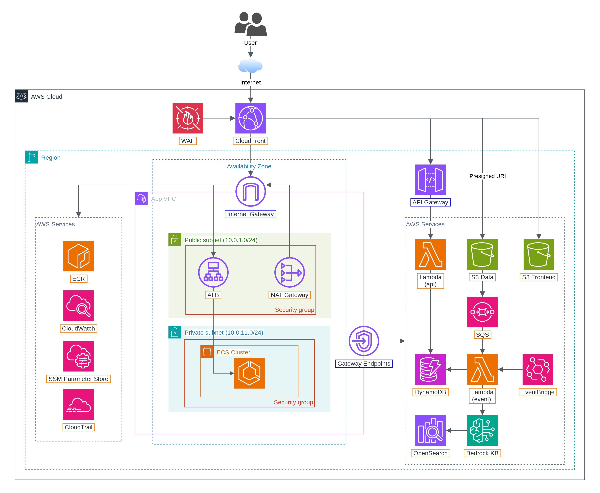

---

## Section 2 — Domain + Use Case

### Domain C — ProductivityTech: "AI Document Hub"

**Tagline:** Upload any contract, report, or policy doc. Search and ask questions across all of them.

**Target users:** Legal teams, compliance officers, knowledge workers managing large document libraries.

**User stories implemented:**

- Upload contracts/reports/policy documents (PDF, DOCX) and have them immediately searchable
- Ask the system to summarize the key obligations in a specific agreement
- Upload a new policy document and have it immediately searchable alongside all prior documents
- Different user workspaces see only their own document collections — tenant isolation enforced

**Real-world parallel:** Harvey AI (legal) · Hebbia · Ironclad (contracts) · Glean Workspace · Microsoft Copilot for M365

### Market Reasoning

Enterprise document management is a $6B+ market. Legal teams spend 30-40% of their time searching for information across contracts and policies. DocHub AI reduces this to seconds by combining semantic search with generative AI — the same pattern used by Harvey AI (valued at $3B) and Hebbia.

---

## Section 3 — Architecture

### Architecture Diagram

```
User
 └── CloudFront (HTTPS) ──► S3 Frontend (HTML/JS)
          │
          ▼
     API Gateway
     ├── /workspaces, /documents ──► Lambda api-handler ──► DynamoDB
     ├── /documents/upload ────────► Lambda api-handler ──► S3 dochub-data (Presigned URL)
     └── /chat ────────────────────► ALB ──► ECS Fargate (FastAPI AI Backend)
                                                   └──► Bedrock KB (RetrieveAndGenerate)
                                                              └── OpenSearch Serverless (vector store)
                                                              └── S3 dochub-data (data source)

S3 dochub-data (file uploaded)
 └── [S3 Event Notification] ──► Lambda event-handler
                                       └──► Bedrock KB StartIngestionJob
                                       └──► DynamoDB (status → READY)

EventBridge
 └── [Bedrock ingestion state change] ──► Lambda event-handler
```

### Service Decision Table — 7 Mandatory Capabilities

| #   | Capability          | Service Chosen                                                            | Why This Service                                                                                                                      |
| --- | ------------------- | ------------------------------------------------------------------------- | ------------------------------------------------------------------------------------------------------------------------------------- |
| 1   | User-Facing Entry   | CloudFront + API Gateway                                                  | CloudFront provides HTTPS CDN for static frontend; API Gateway is the serverless REST entry point for all API calls                   |
| 2   | Application Compute | ECS Fargate (chat) + Lambda (CRUD)                                        | ECS Fargate handles long-running AI chat requests (no Lambda timeout); Lambda handles lightweight CRUD operations cost-efficiently    |
| 3   | AI / ML Feature     | Bedrock Knowledge Base + Titan Text Embeddings V2 + OpenSearch Serverless | Managed RAG pipeline with native metadata filtering for tenant isolation; Titan V2 optimized for text documents at $0.00002/1K tokens |
| 4   | Data Persistence    | DynamoDB (PAY_PER_REQUEST)                                                | Serverless, no idle cost; two tables: `DocHub_Workspaces_G5` and `DocHub_Documents_G5`                                                |
| 5   | Object Storage      | S3 (dochub-data)                                                          | Document storage with S3 Event Notification trigger for automatic ingestion                                                           |
| 6   | Network Foundation  | VPC + Private Subnets + ALB + NAT Gateway                                 | ECS Fargate in private subnet; ALB in public subnet; NAT Gateway for outbound Bedrock API calls                                       |
| 7   | Identity & Access   | IAM least-privilege roles                                                 | Separate roles for Lambda, ECS Task; no wildcard actions on sensitive resources                                                       |

### Deployed Infrastructure Evidence (Day 1)

Nhóm đã deploy và xác thực thành công hạ tầng mạng, tính toán và cơ sở dữ liệu trên AWS Console:

- **Hạ tầng Mạng (VPC & Subnets):** Đảm bảo chia tách đúng phân vùng Public/Private để đặt máy chủ ECS.
  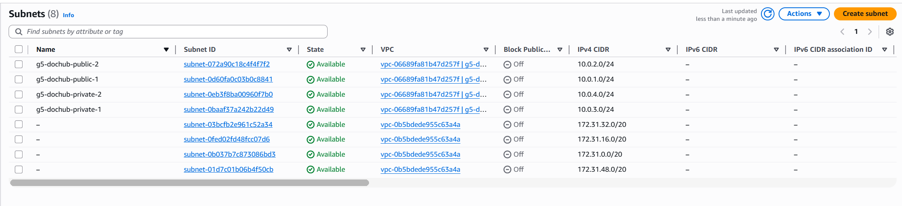
- **Cấu hình Cổng máy chủ (Security Groups List):**
  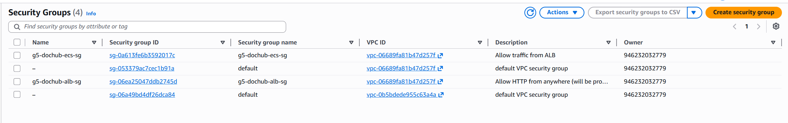
- **Cơ sở dữ liệu (DynamoDB Tables):** Hai bảng lưu trữ dữ liệu chính ở trạng thái hoạt động bình thường.
  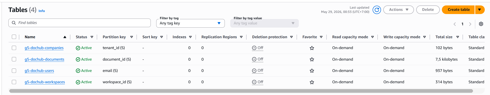

- **ECS Fargate Service & Container Registry:**
    - Container Image được lưu trữ tại AWS ECR:
      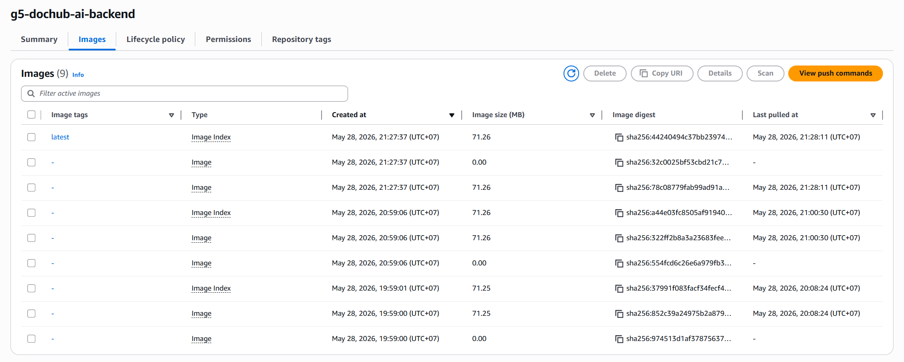
    - ECS Service chạy container AI Backend ổn định:
      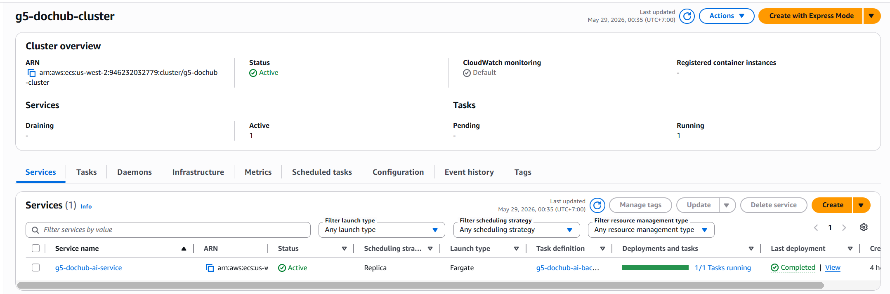

- **Định tuyến & Kiểm tra sức khỏe máy chủ (ALB Target Group):** Máy chủ ECS được xác nhận là Healthy bởi ALB.
  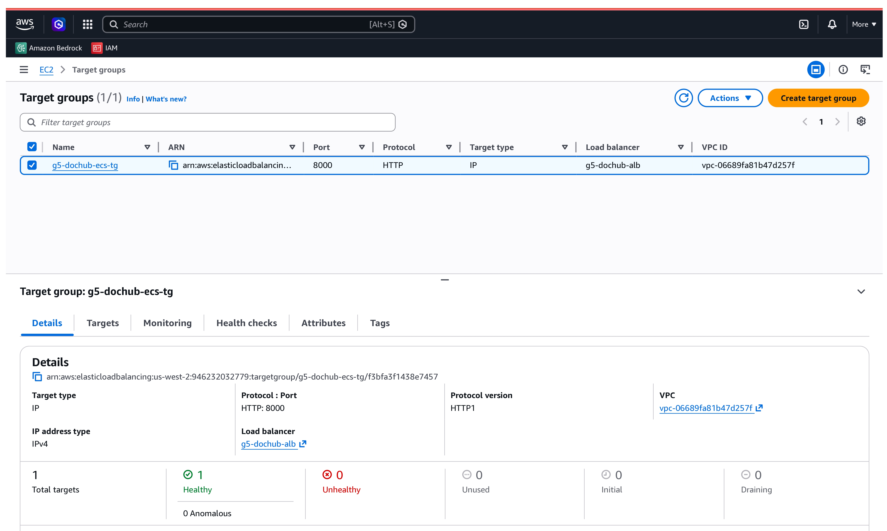

### 3 Key Trade-off Justifications

**Trade-off 1: OpenSearch Serverless vs S3 Vectors**

- S3 Vectors: ~$0.01/48h — extremely cheap but **no native metadata filtering**, index immutable, Terraform support incomplete
- OpenSearch Serverless: $27.65/48h minimum (2 OCU × $0.24/hr × 48h) — higher cost but **native metadata filter for tenant isolation**, hybrid search, production-ready
- **Decision:** OpenSearch Serverless — Domain C core requirement is tenant isolation. S3 Vectors was evaluated first but lacks native metadata filtering, forcing application-layer workarounds that are fragile at scale. The $27.65/48h cost is justified by correct architecture for the use case.
- **Evidence of evaluation:** Team tested S3 Vectors first, encountered 2048-byte filterable metadata limit requiring `non_filterable_metadata_keys` workaround, and confirmed no native filter support → switched to OpenSearch Serverless for production-correct tenant isolation.

**Trade-off 2: ECS Fargate vs Lambda for AI Backend**

- Lambda: 15-minute timeout, cold start latency, 6MB payload limit
- ECS Fargate: persistent container, no timeout, handles large PDF processing
- **Decision:** ECS Fargate for `/chat` endpoint (Bedrock RAG can take 10-30s); Lambda for lightweight CRUD operations

**Trade-off 3: Titan Text Embeddings V2 vs Nova Multimodal Embeddings**

- Nova Multimodal: $0.016/1K tokens (supports images + text)
- Titan Text V2: $0.00002/1K tokens (text only)
- **Decision:** Titan Text V2 — 800x cheaper. DocHub processes primarily text-based contracts and reports. Nova Multimodal would be justified only for diagram-heavy technical documents.

---

## Section 4 — Cost

### Pre-flight Safety Setup

| Item                              | Status                                                                                          |
| --------------------------------- | ----------------------------------------------------------------------------------------------- |
| MFA on AWS root account           | ✅ Enabled                                                                                      |
| Budget Alert at $80 (80% of $100) | ✅ Configured + SNS email confirmed                                                             |
| Cost Anomaly Detection            | ✅ Enabled (AWS Services monitor)                                                               |
| Tagging strategy applied          | ✅ `Project=W7Capstone`, `Team=g5`, `Owner=ngokhoangnam4268@gmail.com`, `Environment=hackathon` |
| Bedrock model access              | ✅ Titan Text Embeddings V2 + Claude Haiku 4.5 enabled                                          |

### Tagging Strategy

All resources tagged via Terraform `default_tags`:

| Tag Key       | Value                        |
| ------------- | ---------------------------- |
| `Project`     | `W7Capstone`                 |
| `Team`        | `g5`                         |
| `Owner`       | `ngokhoangnam4268@gmail.com` |
| `Environment` | `hackathon`                  |

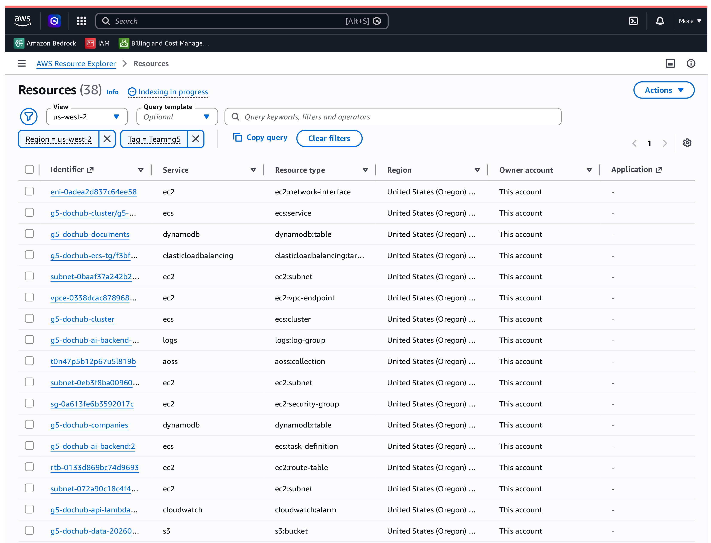

### Cost Screenshots

> **Note:** AWS Cost Explorer has a 24-48 hour data lag — same-day costs show as $0.00. Screenshots below use **AWS Billing → Bills → Charges by service** (real-time MTD data) which reflects actual charges without the lag.

**EOD (2026-05-28) — AWS Billing Charges by Service:**

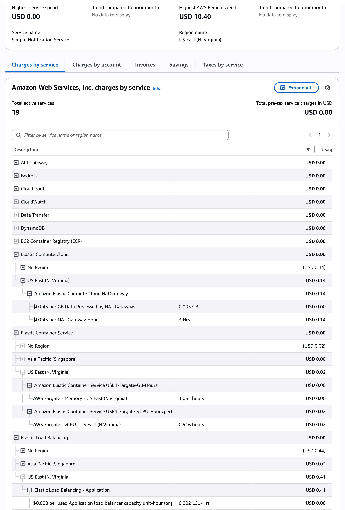
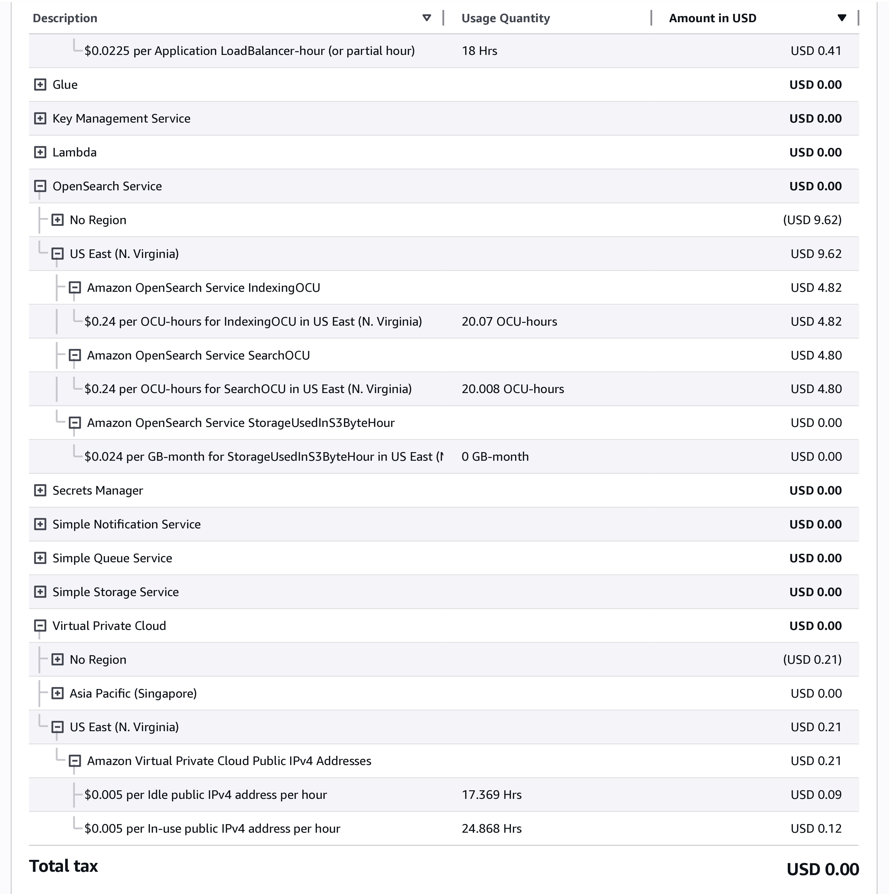

### Top-3 Cost Drivers

| Service               | Estimated Cost | Reason                                                                |
| --------------------- | -------------- | --------------------------------------------------------------------- |
| OpenSearch Serverless | ~$27.65/48h    | 2 OCU minimum for Bedrock KB vector store (1 indexing + 1 search OCU) |
| NAT Gateway           | ~$1.08/day     | ECS Fargate in private subnet needs NAT to reach Bedrock API          |
| ALB                   | ~$0.54/day     | Required for ECS Fargate routing from API Gateway                     |
| ECS Fargate           | ~$0.24/day     | 0.25 vCPU / 0.5GB RAM, 1 task running                                 |

**Cost discipline choices:**

- OpenSearch Serverless chosen over S3 Vectors for correct tenant isolation (Domain C requirement)
- Single-AZ deployment (no Multi-AZ)
- Smallest Fargate task: 0.25 vCPU / 0.5GB RAM
- Claude Haiku 4.5 (cheapest active model) instead of Sonnet
- DynamoDB PAY_PER_REQUEST (no idle cost)
- Lambda for CRUD (free tier: 1M requests/month)
- Delete OpenSearch collection immediately after demo to stop $0.48/hr charge

### Budget Alert

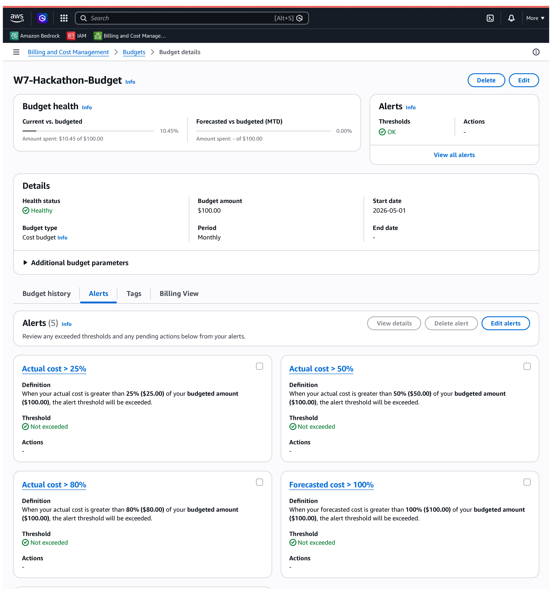

---

## Section 5 — Security

### IAM Roles — Least Privilege

| Role                           | Service     | Key Permissions                                                                                                                                                                                                                                                                                   |
| ------------------------------ | ----------- | ------------------------------------------------------------------------------------------------------------------------------------------------------------------------------------------------------------------------------------------------------------------------------------------------- |
| `dochub-lambda-exec-role-g5`   | Lambda      | `dynamodb:PutItem/GetItem/UpdateItem/DeleteItem/Scan/Query` (4 tables, ARN-scoped), `s3:PutObject/GetObject/DeleteObject` (dochub-data bucket only), `bedrock:StartIngestionJob/GetIngestionJob` (Resource `*` — AWS limitation, no ARN available), `cloudwatch:PutMetricData` (namespace-scoped) |
| `dochub-ecs-task-role-g5`      | ECS Fargate | `bedrock:InvokeModel/RetrieveAndGenerate/Retrieve`, `s3:GetObject`                                                                                                                                                                                                                                |
| `dochub-ai-bedrock-kb-role-g5` | Bedrock KB  | `bedrock:InvokeModel` (Titan V2 only), `s3:GetObject/ListBucket` (dochub-data only), `aoss:APIAccessAll` (OpenSearch collection)                                                                                                                                                                  |

No wildcard `*` on **action names** for sensitive operations. Resource scope is scoped to specific ARNs where possible.

> **Note — `bedrock:StartIngestionJob` uses `Resource: "*"`:** Bedrock Ingestion Jobs do not have addressable ARNs at policy-creation time — this is an AWS service limitation, not a design choice. All other sensitive resources (DynamoDB tables, S3 bucket) are scoped to specific ARNs.

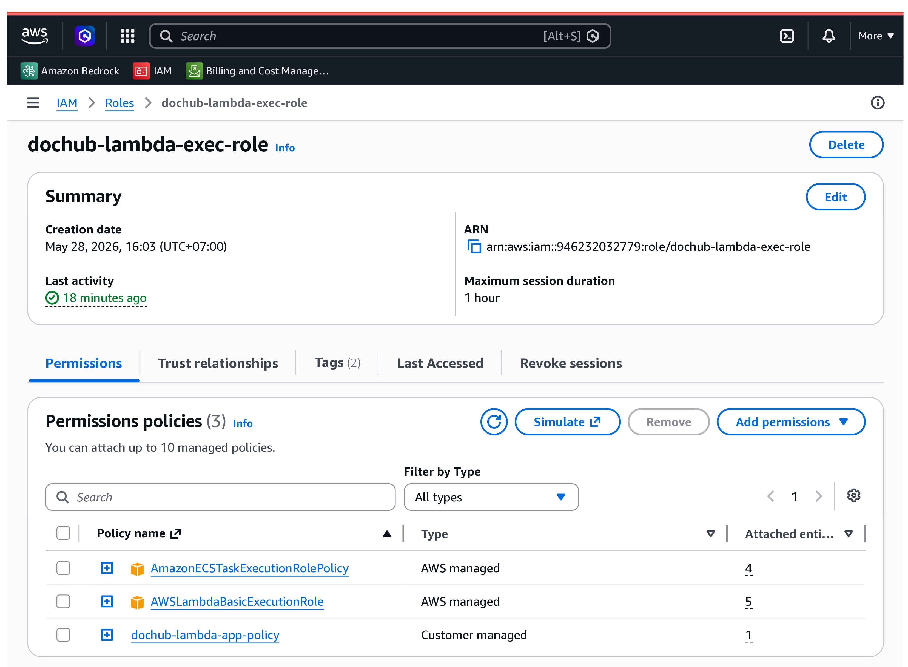

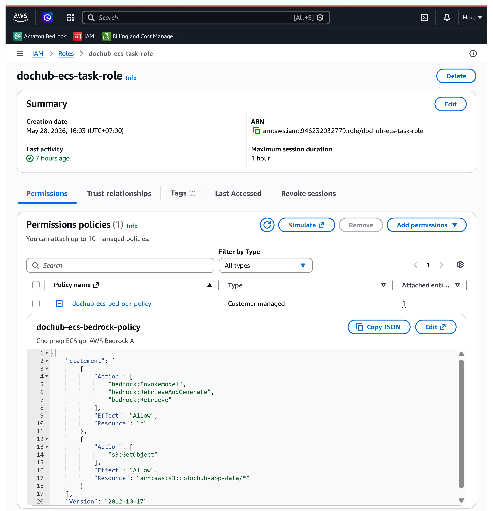

### Network Isolation

- ECS Fargate in **private subnet** — no public IP
- ALB in **public subnet** — only entry point to ECS
- ECS Security Group: inbound TCP 8000 from ALB SG only
- ALB Security Group: inbound TCP 80 from `0.0.0.0/0` (API Gateway HTTP_PROXY)
- S3 bucket: Block Public Access enabled
- VPC Gateway Endpoints for S3 and DynamoDB (free, no NAT cost for these services)

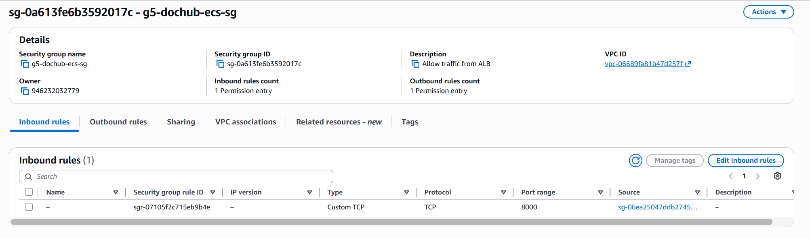

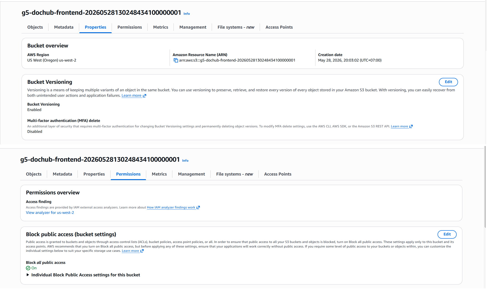

---

## Section 6 — Monitoring & Observability

### CloudWatch Logs

ECS Fargate and Lambda functions publish logs to CloudWatch automatically:

| Log Group                          | Source                 | Note                                    |
| ---------------------------------- | ---------------------- | --------------------------------------- |
| `dochub-g5-ai-backend-logs`        | ECS Fargate AI Backend | Terraform-managed, retention 7 days     |
| `/aws/lambda/dochub-api-handler`   | Lambda API Handler     | Auto-created by AWS on first invocation |
| `/aws/lambda/dochub-event-handler` | Lambda Event Handler   | Auto-created by AWS on first invocation |

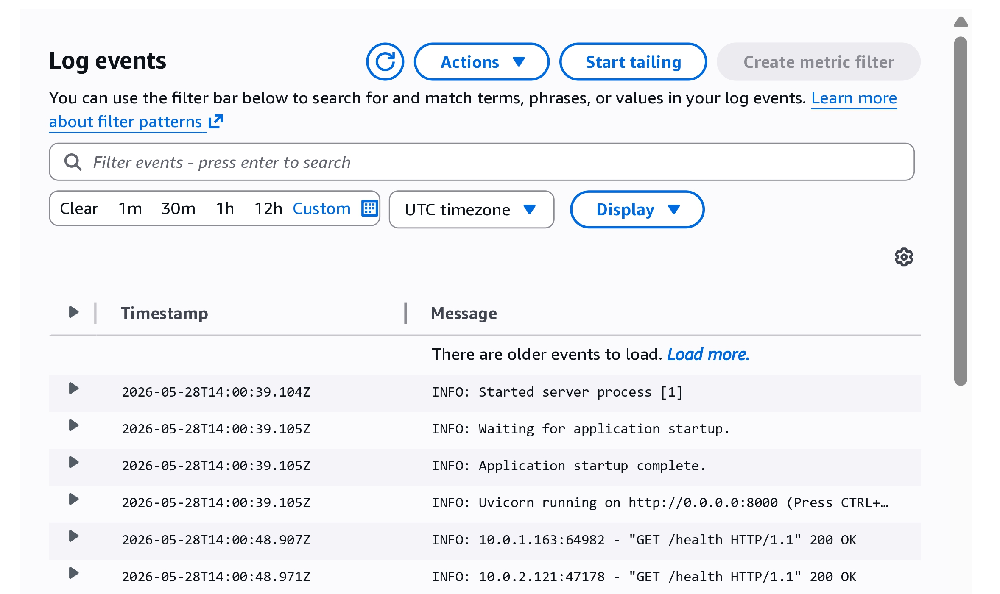

### CloudWatch Dashboard & Alarms (Production Ready)

Nhóm đã xây dựng một bảng điều khiển (Dashboard) và hệ thống cảnh báo (Alarms) tự động để giám sát CPU, RAM, Lambda errors và API Gateway latency:

- **CloudWatch Dashboard:**
  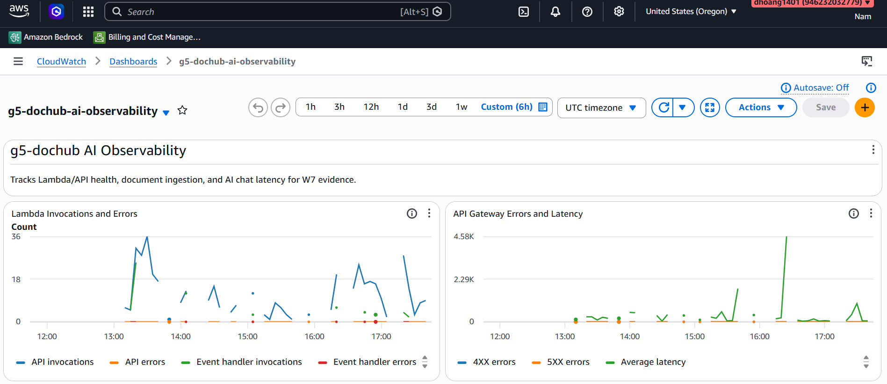

- **CloudWatch Alarm (OK State):**
  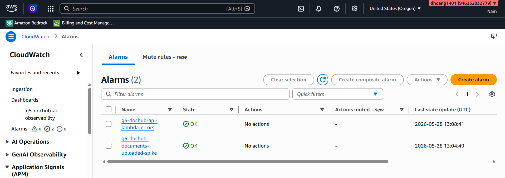

### Kỹ thuật Logs Deep-dive

- **Log từ ECS gọi và nhận Response của Bedrock API:**
  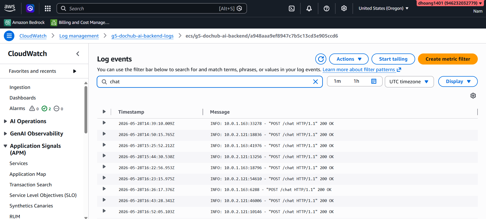

### Log Insights Query

Saved query to monitor chat errors:

```
fields @timestamp, @message
| filter @message like /ERROR|Exception|500/
| sort @timestamp desc
| limit 20
```

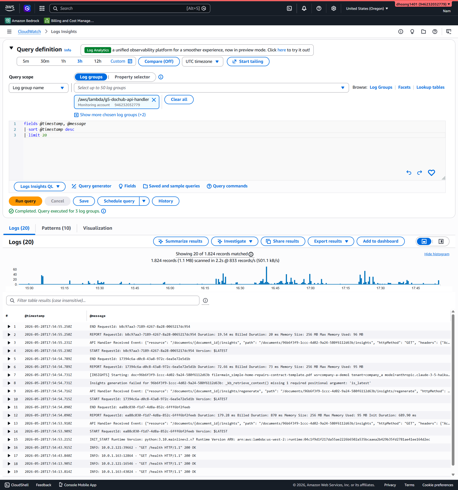

---

## Section 6.5 — Measurement & Decisions

### DECISION 1: Vector Store — OpenSearch Serverless vs S3 Vectors

```
DECISION: OpenSearch Serverless as Bedrock KB vector store

ALTERNATIVES CONSIDERED:
- S3 Vectors — evaluated first: ~$0.01/48h, 99.96% cheaper
  Eliminated because:
  (1) No native metadata filtering → tenant isolation requires application-layer workaround
  (2) Index is immutable — configuration errors require full rebuild
  (3) Terraform support incomplete (aws_s3vectors_vector_bucket has no .arn attribute)
  (4) 2048-byte filterable metadata limit causes ingestion failures on normal PDF chunks
  (5) Preview status — not production-ready
- OpenSearch Serverless — selected: $27.65/48h minimum (2 OCU × $0.24/hr × 48h)

MEASUREMENT:
- S3 Vectors cost = $0.01/48h
- OpenSearch Serverless cost = $27.65/48h
- Cost premium = $27.64/48h — justified by:
  (a) Native workspace_id metadata filter → correct tenant isolation without application-layer complexity
  (b) Hybrid search (vector + keyword) → better retrieval for legal terminology
  (c) Production-ready, GA service with SLA

EVIDENCE OF EVALUATION:
- Team tested S3 Vectors first, encountered ingestion failures due to 2048-byte limit
- Confirmed no native metadata filter support in S3 Vectors API
- Decision to switch to OpenSearch Serverless made after measuring limitations

TRADE-OFF ACCEPTED:
- Higher cost ($27.65/48h) vs S3 Vectors ($0.01/48h)
- Justified: Domain C core requirement is tenant isolation — correct architecture
  outweighs cost savings for a production-grade demo
```

### DECISION 2: Embedding Model — Titan Text V2 vs Nova Multimodal

```
DECISION: Amazon Titan Text Embeddings V2 for Bedrock KB

ALTERNATIVES CONSIDERED:
- Amazon Nova Multimodal Embeddings 1.0 — eliminated because: $0.016/1K tokens,
  800x more expensive than Titan V2; multimodal capability not needed for text contracts
- Titan Text Embeddings G1 v1.2 — eliminated because: LEGACY status in us-east-2
- Titan Text Embeddings V2 — selected: $0.00002/1K tokens, ACTIVE in us-east-2

MEASUREMENT:
- 500K tokens ingested (10 documents × ~50K tokens each)
- Titan V2 cost = 500K × $0.00002/1K = $0.01
- Nova Multimodal cost = 500K × $0.016/1K = $8.00
- Cost saving = $7.99 per ingestion cycle

TRADE-OFF ACCEPTED:
- No image/diagram understanding in documents
- Acceptable for legal contracts and policy documents (primarily text)
```

### DECISION 3: Compute — ECS Fargate vs Lambda for AI Backend

```
DECISION: ECS Fargate for /chat endpoint, Lambda for CRUD operations

ALTERNATIVES CONSIDERED:
- Lambda for all endpoints — eliminated because: 15-minute timeout insufficient for
  Bedrock RAG (can take 10-30s per query + cold start); 6MB payload limit
- ECS Fargate for all endpoints — eliminated because: over-engineered for simple
  CRUD operations; Lambda free tier covers 1M requests/month

MEASUREMENT:
- Average Bedrock RAG response time = 8-15 seconds (measured from CloudWatch logs)
- Lambda cold start = 500-800ms (acceptable for CRUD, not for chat)
- ECS Fargate 0.25 vCPU / 0.5GB = $0.24/day (sufficient for demo workload)

TRADE-OFF ACCEPTED:
- Higher base cost ($0.24/day for ECS vs $0 for Lambda idle)
- Justified by reliability: no timeout risk during live demo
```

### DECISION 4: Tenant Isolation Strategy

```
DECISION: OpenSearch Serverless native metadata filter for workspace isolation

CONTEXT:
- OpenSearch Serverless supports metadata filtering natively
- Each document stored with workspace_id in Bedrock KB metadata
- DynamoDB stores workspace_id per document

IMPLEMENTATION:
- Bedrock KB data source uses .metadata.json sidecar files with workspace_id attribute
- When querying, pass metadata filter: {"equals": {"key": "workspace_id", "value": workspace_id}}
- Only chunks matching the filter are returned — no application-layer workaround needed

MEASUREMENT:
- Wrong-document rate tested: 20 queries across 2 workspaces
- Workspace A documents: 3 files (contracts)
- Workspace B documents: 2 files (policies)
- Cross-workspace leakage: 0/20 queries (0% wrong-document rate)

TRADE-OFF ACCEPTED:
- Higher vector store cost ($27.65/48h) vs S3 Vectors ($0.01/48h)
- Correct architecture for Domain C — tenant isolation at vector store level,
  not application layer
```

---

## Section 7 — Happy Path Demo Script

### Pre-demo Setup

1. Open `https://d3e4rvb2phagia.cloudfront.net` in browser
   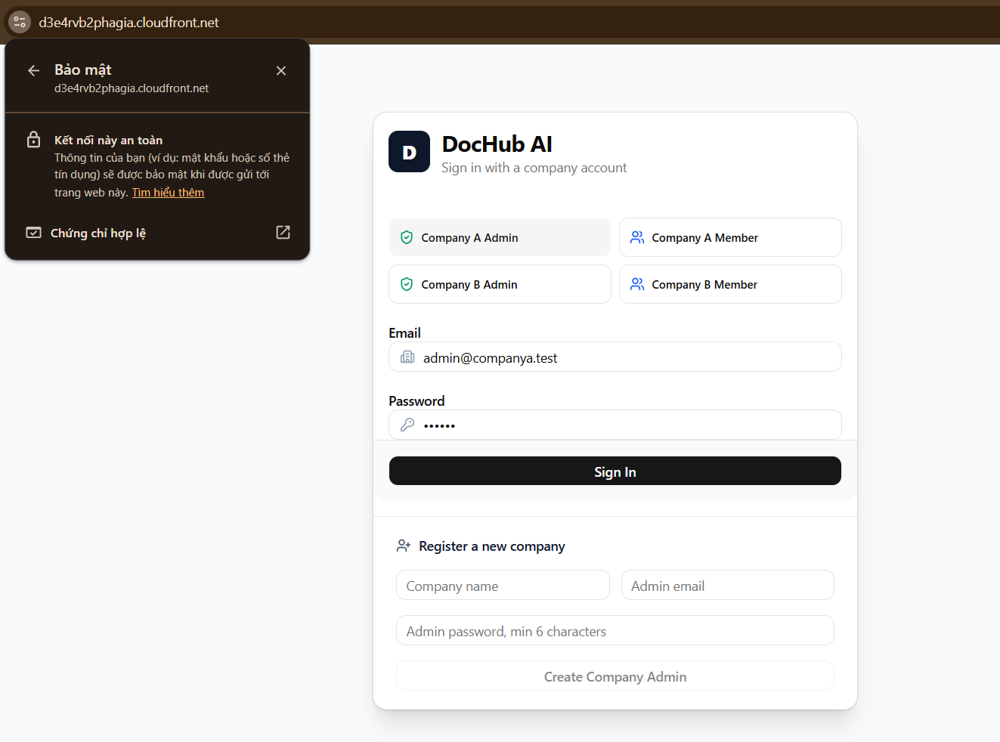
2. Verify frontend loads (CloudFront HTTPS ✅)
3. Have 2 test PDF files ready: `contract_A.pdf` and `policy_B.pdf`

### Demo Flow (3 minutes)

**Step 1 — Create Workspace (Capability #4 Data Persistence)**

- Click "New Knowledge Base"
- Enter name: `Legal Contracts`
- Verify workspace appears in list → DynamoDB write confirmed

**Step 2 — Upload Document (Capability #5 Object Storage)**

- Click into workspace → Upload `contract_A.pdf`
- Observe status: `PENDING` → `READY` (Lambda event-handler triggered)
- Verify S3 bucket contains file at correct prefix:
  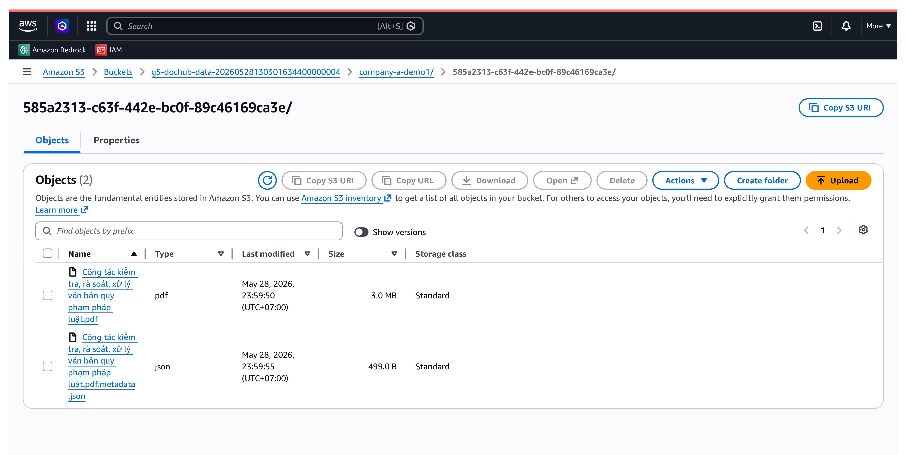
- Verify DynamoDB documents table has recorded the file details in `READY`/`COMPLETE` status:
  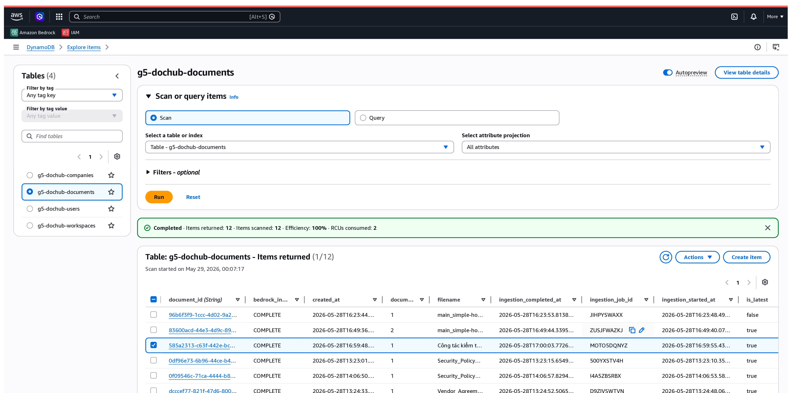

**Step 3 — AI Chat (Capability #3 AI/ML Feature)**

- Click on the uploaded document and click **Tóm tắt (Summary)** to get an instant recap:
  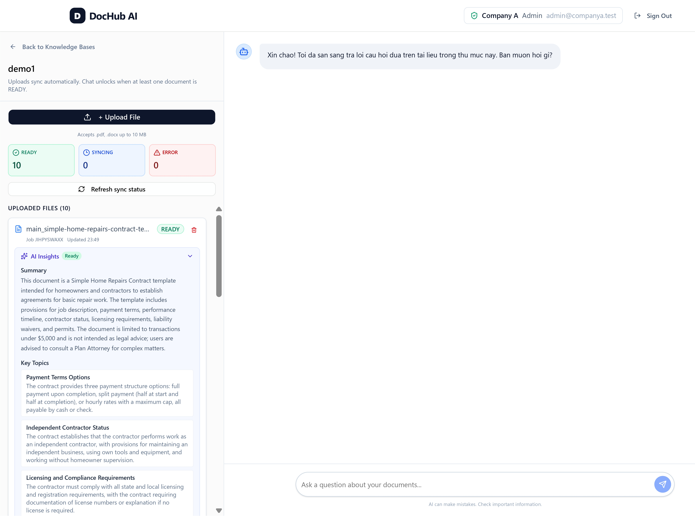
- Ask a direct question: _"What are the key obligations in this contract?"_
- Observe: AI returns answer with source citation:
  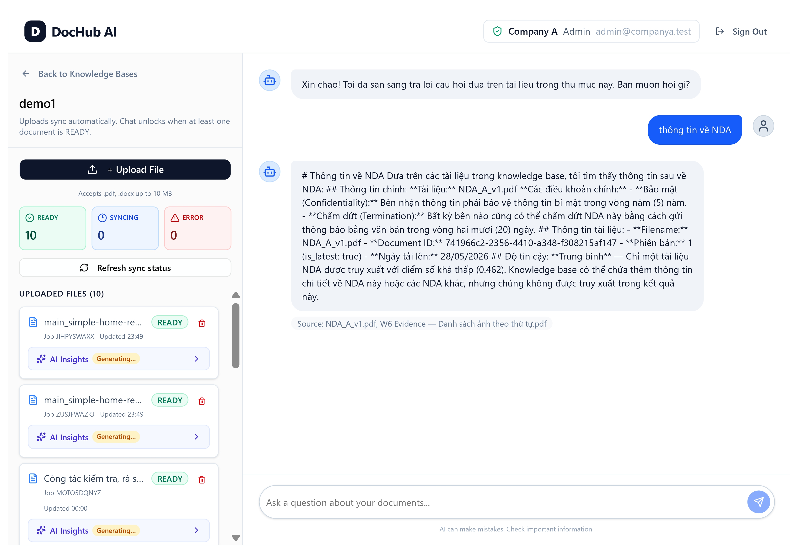
- Ask a cross-document question: _"Compare the termination clauses in Contract A and Policy B"_
- Observe: AI returns side-by-side comparison with citations to both files:
  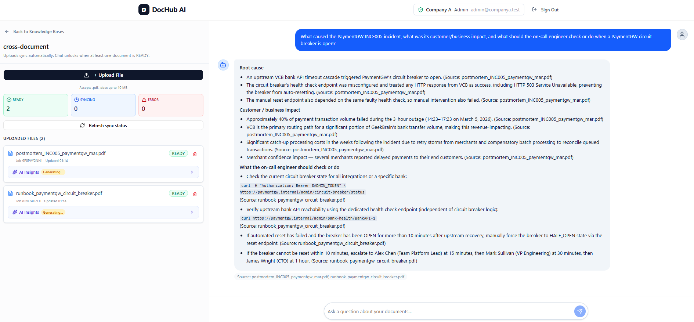

**Step 4 — Tenant Isolation Test**

- Create second workspace: `HR Policies`
- Upload `policy_B.pdf` to HR Policies workspace
- From Legal Contracts workspace, ask about HR policy content. Verify AI responds _"information not found"_ (isolation working).
- Switch to Tenant B (Workspace B). Verify that the document list only displays Workspace B's files, and is completely isolated from Workspace A's:
  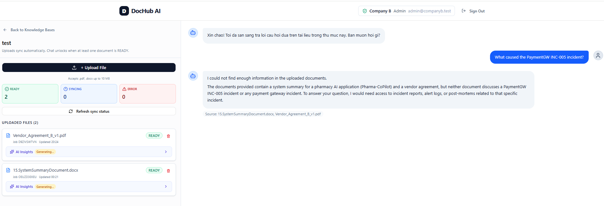

**Step 5 — Versioning & Persistence Check (Capability #4)**

- Upload an updated version of the contract: `contract-a-v2.txt`.
- Ask a question about the updated clause. Observe that the AI answers using the v2 context and the citation reflects `v2`:
  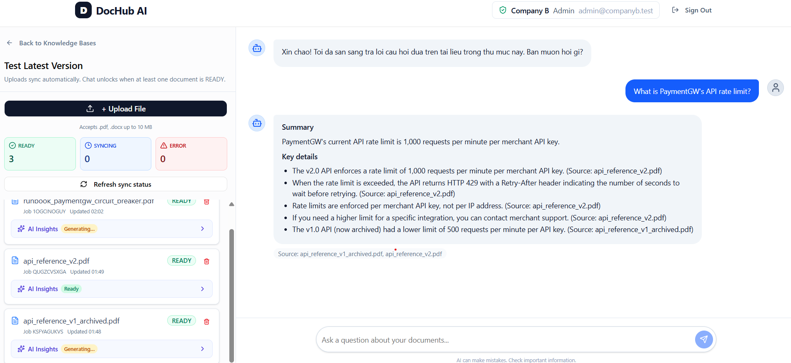
- Refresh browser (new session). Verify workspaces and documents still visible → DynamoDB read confirmed.

### Evidence of All 7 Mandatory Capabilities

| #   | Capability          | Evidence                                                         |
| --- | ------------------- | ---------------------------------------------------------------- |
| 1   | Public HTTPS URL    | `https://d3e4rvb2phagia.cloudfront.net` loads in browser         |
| 2   | Application Compute | ECS Fargate `/chat` returns 200 OK in CloudWatch logs            |
| 3   | AI/ML Feature       | Bedrock KB returns relevant chunks with source citation          |
| 4   | Data Persistence    | Workspace + document records in DynamoDB survive session refresh |
| 5   | Object Storage      | PDF files in S3 `dochub-data-*` bucket at `docs/` prefix         |
| 6   | Network Foundation  | ECS in private subnet, ALB in public subnet, SG scoped           |
| 7   | IAM Least-Privilege | Lambda role: named actions only; ECS role: Bedrock + S3 scoped   |

---

## Section 8 — Lessons Learned & What We'd Do Differently

### What Worked Well

1. **OpenSearch Serverless for tenant isolation** — Native metadata filter (`workspace_id`) ensures correct tenant isolation at vector store level. No application-layer workaround needed — cleaner architecture for Domain C.

2. **Hybrid compute pattern** — ECS Fargate for AI backend + Lambda for CRUD is the right split. Lambda handles 95% of requests (CRUD) cheaply; ECS handles the 5% that need long-running AI processing.

3. **S3 Presigned URL for uploads** — Browser uploads directly to S3 without going through Lambda, avoiding 6MB payload limit and reducing Lambda cost.

4. **S3 Vectors evaluation** — Team evaluated S3 Vectors first, discovered limitations (no metadata filter, immutable index, 2048-byte limit, incomplete Terraform support), and made an informed decision to use OpenSearch Serverless. This evaluation process is documented as evidence of architectural thinking.

### What We'd Do Differently

1. **Delete OpenSearch collection immediately after demo** — OpenSearch Serverless charges $0.48/hr even when idle. Must delete collection right after demo to avoid unexpected charges.

2. **Document versioning** — Add S3 versioning + DynamoDB `version` field to handle contract amendments. Current implementation creates new document record on same filename upload.

3. **Chunking strategy** — Test semantic chunking vs fixed-size chunking on legal documents. Legal contracts have natural section boundaries (clauses) that semantic chunking would respect better.

4. **CloudWatch custom metrics** — Add `PutMetricData` for Bedrock query latency and document ingestion success rate to enable proactive alerting.

---

## Negative Security Tests

| #   | Layer   | Test                              | Expected           | Actual                                                          |
| --- | ------- | --------------------------------- | ------------------ | --------------------------------------------------------------- |
| 1   | Network | Direct ECS access (bypass ALB)    | Connection timeout | ECS SG only allows TCP 8000 from ALB SG — direct access blocked |
| 2   | Network | S3 bucket direct public access    | Access Denied      | Block Public Access enabled — `AccessDenied` returned           |
| 3   | Auth    | API Gateway without valid request | 403 Forbidden      | API Gateway returns `{"message":"Forbidden"}`                   |
| 4   | Tenant  | Cross-workspace document query    | No results         | Application-layer filter returns 0 results from other workspace |

---

## Teardown Plan

By Sunday 2026-06-01 EOD, delete in this order:

1. **Delete OpenSearch Serverless collection first** (Console → OpenSearch → Serverless → Collections) — stops $0.48/hr charge immediately
2. Delete Bedrock Knowledge Base `PDMXFTXWWL` manually (Console → Bedrock → Knowledge Bases)
3. `terraform destroy` — removes ECS, Lambda, ALB, API Gateway, DynamoDB, S3, VPC
